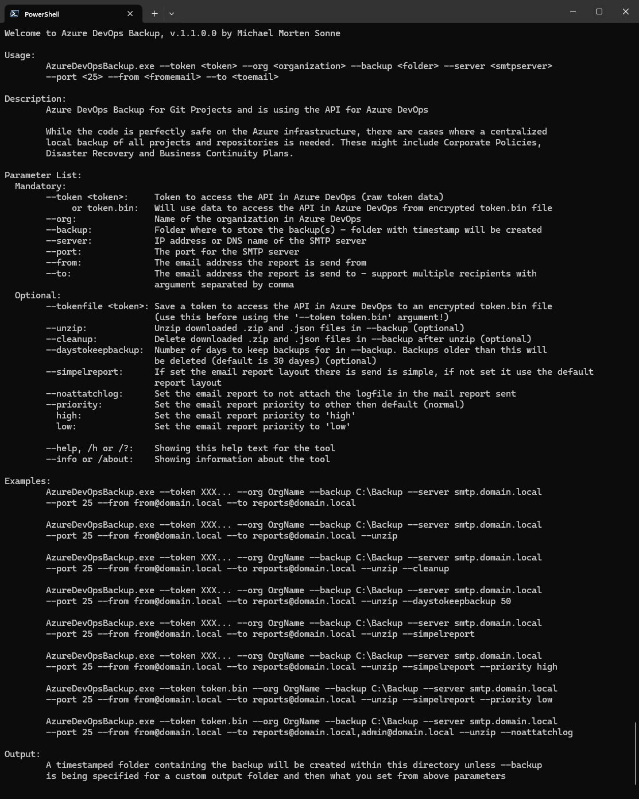
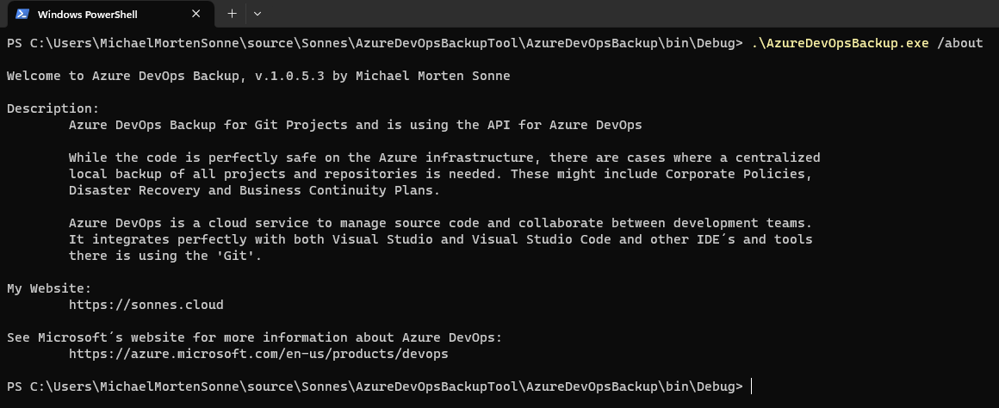
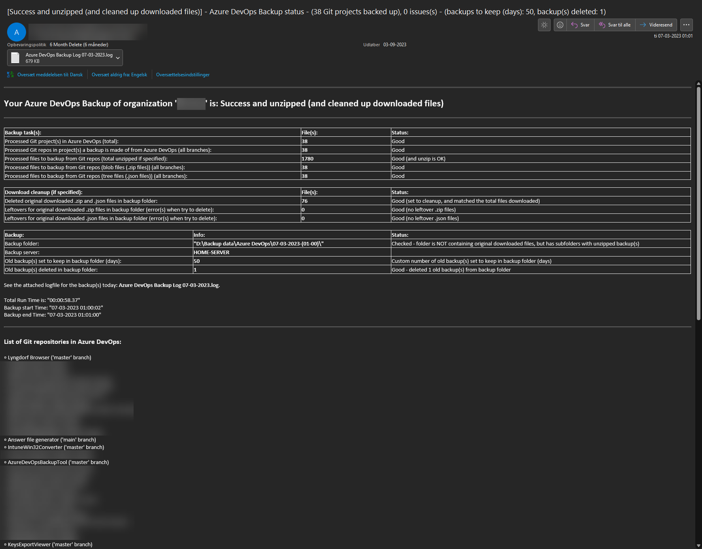
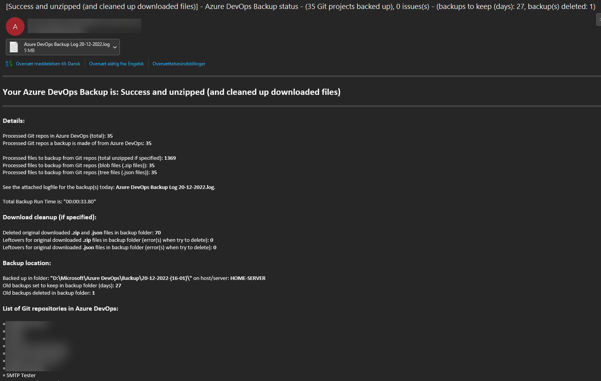

# Azure DevOps Backup

  
  
  

  <a href="https://github.com/michaelmsonne/AzureDevOpsBackupTool/issues/new?assignees=&labels=bug&template=01_BUG_REPORT.md&title=bug%3A+">Report a Bug</a>
  ·
  <a href="https://github.com/michaelmsonne/AzureDevOpsBackupTool/issues/new?assignees=&labels=enhancement&template=02_FEATURE_REQUEST.md&title=feat%3A+">Request a Feature</a>
  .
  <a href="https://github.com/michaelmsonne/AzureDevOpsBackupTool/discussions">Ask a Question</a>

 

## Table of Contents
- [Introduction](#introduction)
- [Contents](#contents)
- [Features](#features)
- [Download](#download)
- [Getting Started](#getting-started)
  - [Prerequisites](#prerequisites)
  - [Installation](#installation)
- [Usage](#usage)
- [Examples](#examples)
- [Contributing](#contributing)
- [Support](#support)
- [License](#license)

# Introduction
Azure DevOps is a cloud service to manage source code and collaborate between development teams. It integrates perfectly with both Visual Studio and Visual Studio Code and other IDE´s and tools there is using the "Git".
While your code is perfectly safe on the Azure infrastructure hosted by Microsoft, there are cases where a centralized local backup of all projects and repositories is needed. These might include Corporate Policies, Disaster Recovery and Business Continuity Plans.
We can download a repository from Azure DevOps as a Zip file, but this may not be practical if we have a considerable amount of projects and repositories and need them backed up on a regular basis. To do this, we can use the Azure DevOps API, as explained here: https://learn.microsoft.com/en-us/rest/api/azure/devops/?view=azure-devops-rest-7.1 💪

## Contents

Outline the file contents of the repository. It helps users navigate the codebase, build configuration and any related assets.

| File/folder                  | Description                                 |
|------------------------------|---------------------------------------------|
| `AdvancedInstaller`          | Code for installer project                  |
| `AzureDevOpsBackup`          | Source code for the main backup tool itself.|
| `AzureDevOpsBackupUnzipTool` | Source code for the unzip tool itself.      |
| `docs`                       | Documents/pictures.                         |
| `.gitignore`                 | Define what to ignore at commit time.       |
| `CHANGELOG.md`               | List of changes to the sample.              |
| `CONTRIBUTING.md`            | Guidelines for contributing to the AzureDevOpsBackupTool.|
| `README.md`                  | This README file.                           |
| `SECURITY.md`                | Security file.                              |
| `LICENSE`                    | The license for the AzureDevOpsBackupTool.  |

## Features

### AzureDevOpsBackup:

#### Overall:
- Asynchronous Resolution: Utilizes asynchronous processing for improved performance and responsiveness, allowing users to continue working while backups are being created.
- Simplicity and Ease of Use: Provides a straightforward and user-friendly method for creating backups from Azure DevOps repositories.

#### List:
- Backup Functionality:
  - Repository backup: Enables users to create local backups of Azure DevOps repositories.
  - Customizable backup Options: Offers various command-line options to tailor the backup process, including specifying backup directories, token authentication, cleanup, backup retention period, and more.
  - Zip file handling: Ability to download repository items as ZIP files and organize them locally, optionally extracting them into a directory structure using the --unzip argument.
  - Automated cleanup: Supports cleanup functionality to manage the disk space occupied by the backup files.
  - Backup Retention: Allows users to specify the number of days to retain backups, automatically removing older backups based on the set retention period using the --daystokeepbackup argument.

- Email Reporting:
  - Email notifications: Sends detailed email reports upon backup completion, providing status updates, backup job information, and relevant details.
  - Email customization: Offers different email layouts (--simpelreportlayout) to cater to varying preferences or requirements.
  - Priority configuration: Provides the option to set email priority (--priority) for the backup completion notification.
 
- Logging:
  - Job logging: Stores logs for backup jobs in a designated folder (.\Log) for a defined period (default: 30 days) beside the **AzureDevOpsBackup.exe** executable.

### AzureDevOpsBackup unzip tool:

#### Overall:
- Unzip Functionality: Allows users to extract ZIP files and JSON metadata into a directory structure, renaming GUIDs to file or folder names for a specific repository backup.
- Simplicity and Ease of Use: Provides a straightforward and user-friendly method for unzipping repository backups from Azure DevOps .zip files.

## Download

[Download the latest version](../../releases/latest)

[Version History](CHANGELOG.md)

## Getting Started

1. Downloaded the installer from releases to any location on a Windows machine where you want to use the tool
2. Run the downloaded installer and select where you will install the tool
3. When installed you need an access token to connect to Azure DevOps (read the guide under here)
4. Then run the main AzureDevOpsBackup.exe with the appropriate command line options to connect to your Azure DevOps and download the backup use with command line options in CMD, PowerShell or Windows Terminal!
5. You now have an local backup!

# How to get a local backup of your repos on your backup/home server? 🤔

## 1. Get an Azure DevOps API personal access token
On the top right corner of the Azure DevOps portal we have our account picture. When clicking on it reveals the account menu where we find a Security option. Inside Security, we have Personal access tokens. We click on New token to create one.
For this example we only need to check the Read, write & manage permission for Code. When we name the token and click Create, we get the token value, but since it won’t be shown again, we must copy and save it elsewhere. We will need this token later, to access the API!

## 2. Clone the repository, configure arguments and dependencies
To get the sample code, we can clone this GitHub repository or another and open it with etc. Visual Studio. To test the solution in debug mode, we still have to configure a few arguments in the project properties. These arguments will define the access token — obtained on the previous step — , organization — i.e. the Azure DevOps domain — and the local directory where we want to write the backed up data. There is a fourth optional argument to state if we want to unzip the downloaded files — more on that later.

**N.B:** Keep your generated access token in a safe place!

Here’s how the argument list will look like:

`.\AzureDevOpsBackup.exe --token "our-auth-token" --org "our-org" --outdir "C:\backup\out-directory" --server "smtp.server.com" --port "25" --from "azure-devops-backup@domain.com" --to "backupmail@domain.com" --unzip --cleanup --daystokeepbackup 50 --priority high`

This solution uses two external libraries we need to reference: RestSharp to facilitate the API calls and Newtonsoft JSON to deserialize the API responses into objects.

## 3. Analyze and run the code
We start by declaring the data structures for the API responses. Then, the main function cycles through four nested levels of hierarchy — project / repository / branch / item — calling these API endpoints and deserializing the results into the corresponding structures.
Hence, for each project, we get a list of the repositories it contains and for each repository, we get a list of the items it contains.

When we get to the repository level we don’t need to make individual API calls to download every single item on the repository. Instead, we can download all the items, packed into a Zip file with a single API call. In order to do this, we still need the item list, because we have to build a JSON structure containing every item on the list where the property gitObjectType equals “blob”. This JSON structure will then be posted to the /blobs endpoint to obtain the Zip file as a response.

Note we are also saving the original JSON item list we got from the repository call. This will be needed to map the files inside the Zip package, because these are presented in a single flat directory and their names are the object ids and not their actual names and extension. This is where the --unzip argument enters. If it’s omitted, the process does not go further and we get a simple backup: for every repository of each project we get a Zip file with the content and a JSON file to map it.

## Usage

### AzureDevOpsBackup:

**Paramenters:**

Backup:
- --token
    - token.bin: Use an encrypted .bin file (based on hardware ID´s) with your personal access token in. 
    (Remember to run --tokenfile <token.data> to create the file first beside the application .exe!)
    - <token.data>: Replace this with your Azure DevOps personal access token.
- --org: Replace this with your Azure DevOps organization name.
- --backup: Specify the local directory where you want to store the Azure DevOps repository backups.
- --server: IP address or domain name of the SMTP server for sending email notifications.
- --port: The SMTP server port
- --from: The email address for the notification emails to send from.
- --toemail: The email address to report is send to.
- --unzip: Use this option to extract the downloaded Zip files into a directory structure.
- --cleanup: Use this option to cleanup the blob files downloaded from the API in the backup folder.
- --daystokeepbackup: Set the number of days to retain backup files before automatic removal (default is 30 days if not specified).
- --simpelreportlayout: Use this option to use the old email report layout.
- --priority <priority> <high/low>: Specify the email priority for notifications (e.g., high, normal, low). Default (normal) if not set.

General:
- --help, /h or /?: Show the help menu
- --info or /about: Show the about menu

Mandatory arguments is: **`--token, --org, --outdir, --server, --port, --from and --to`**

**A bit more information about some arguments:**

If the **--unzip** argument is present, the program will create a directory for each repository based on the information provided by each Zip/JSON file pair. In this directory, we will get the original file and folder structure with real file names and extensions. Looping through all the items on the JSON list file, we consider a simple condition: if the item is a folder we create the directory according to the item.path property. Otherwise, we assume it’s a blob and we extract it from the Zip archive into the corresponding directory assigning the original file name and extension.

If the **--cleanup** argument is present, the program will cleanup the blob files downloaded from the API in the backup folder. If not present, the downloaded original .json and .zip files is still the backup folder.
The argument **--unzip** id needed for this to work.

If the **--daystokeepbackup** argument is present, the program will keep that number of days in the backup folder. If not present the default days of backups to keep is **30 days**.
It looks at the backup folder, and see when last changed. If the days matches the days you set, the program **will delete** the old backup in the backup folder you had set.

If the **--simpelreportlayout** argument is present, the program will use the old email report layout, else it will use the new default.

### AzureDevOpsBackup unzip tool:

**Paramenters:**

Unzip from metadata:
- --zipFile: Name of the .zip folder to rename GUID´s to file or folders
- --jsonFile: Name of the .json file with the metadata in to rename GUID´s to files and folders
- --output: Folder to unzip data into

General:
- --help, /h or /?: Show the help menu
- --info or /about: Show the about menu

## Task scheduler (Windows)

The AzureDevOpsBackup.exe tool can be run via Task Scheduler in Windows. This way, you can schedule the backup to run at specific intervals, ensuring that your Azure DevOps repositories are backed up regularly.

The setup for that to work (via my testing and useing over long time) is to create a new task in Task Scheduler with the following settings:

- **General:**
  - **Name**: Azure DevOps Backup or similar
  - **Description**: Backup of Azure DevOps repositories or similar
  - **User account**: Select a user account with the necessary permissions to run the backup job and to wite to the application path (for logs)
  - **Security options**: Run whether user is logged on or not
  - **Security options**: Run with highest privileges
  - **Trigger**: Set the desired schedule for the backup job (e.g., daily, weekly, etc.)
  - **Action**: Start a program
	- **Program/script**: Path to the AzureDevOpsBackup.exe executable
	- **Add arguments**: Add the necessary command-line arguments for the backup job
	- **Start in**: Path to the folder containing the AzureDevOpsBackup.exe executable

	**Sample**:
	- **Program/script**: `D:\AzureDevOpsBackup\AzureDevOpsBackup.exe`
	- **Add arguments**: `--token "xxxxxx" --org "YourOrg" --backup "D:\Backup\Azure DevOps" --server "domain-com.mail.protection.outlook.com" --port "25" --from "azure-devops-backup@domain.com" --to "AZ-DL-AzureDevOpsBackupReports@domain.com" --unzip --cleanup --daystokeepbackup 180`
	- **Start in**: `D:\AzureDevOpsBackup`

## Logs

Logs for backup jobs is keept in the **.\Log** folder for **30 days** beside **AzureDevOpsBackup.exe**.

# Final thoughts
This is not an exhaustive method to retrieve every artifact on Azure DevOps. There’s a lot more to be done to make this a complete solution.
However, it’s a good starting point to backup your Azure DevOps projects and keep a local repository of these like I do! 😜😉

There is send an email report to the specified email address when the backup is done with status and usefull information about the backup job and more information.

## Examples

Check out the examples here:

### AzureDevOpsBackup

`.\AzureDevOpsBackup.exe --token "xxxx..." --org "AzureDevOpsOrgName" --backup "D:\Backup data\Azure DevOps" --server "orgdomain-cloud.mail.protection.outlook.com" --port "25" --from "azure-devops-backup@orgdomain.cloud" --to "AZ-DL-AzureDevOpsBackupReports@orgdomain.cloud" --unzip --cleanup --daystokeepbackup 50`

`.\AzureDevOpsBackup.exe --token "token.bin" --org "AzureDevOpsOrgName" --backup "D:\Backup data\Azure DevOps" --server "orgdomain-cloud.mail.protection.outlook.com" --port "25" --from "azure-devops-backup@orgdomain.cloud" --to "AZ-DL-AzureDevOpsBackupReports@orgdomain.cloud" --unzip --cleanup --daystokeepbackup 50 --simpelreportlayout --priority high`

### AzureDevOpsBackup unzip tool
`.\AzureDevOpsBackupUnzipTool.exe --zipFile "C:\Temp\Test\master_blob.zip" --output "C:\Temp\Test\Test" --jsonFile "C:\Temp\Test\tree.json"`

# Console use:

**Help menu:**

**About menu:**

# Email report sample:

**Full layout:**

**Simpel layout:**

---

## Building

- Get [Visual Studio 2022](https://visualstudio.microsoft.com/vs/community/) (Community Edition is fine)
- Install ".NET desktop development" workload  
  
- Remember to select: Install .NET Framework 4.8 SDK
- Build the solution in Visual Studio

---

# Contributing
If you want to contribute to this project, please open an issue or submit a pull request. I welcome contributions :)

See [CONTRIBUTING](CONTRIBUTING) for more information.

First off, thanks for taking the time to contribute! Contributions are what makes the open-source community such an amazing place to learn, inspire, and create. Any contributions you make will benefit everybody else and are **greatly appreciated**.
Feel free to send pull requests or fill out issues when you encounter them. I'm also completely open to adding direct maintainers/contributors and working together! :)

Please try to create bug reports that are:

- _Reproducible._ Include steps to reproduce the problem.
- _Specific._ Include as much detail as possible: which version, what environment, etc.
- _Unique._ Do not duplicate existing opened issues.
- _Scoped to a Single Bug._ One bug per report.

# Support

Commercial support

This project is open-source and I invite everybody who can and will to contribute, but I cannot provide any support because I only created this as a "hobby project" ofc. with tbe best in mind. For commercial support, please contact me on LinkedIn so we can discuss the possibilities. It’s my choice to work on this project in my spare time, so if you have commercial gain from this project you should considering sponsoring me.

Thanks.

Reach out to the maintainer at one of the following places:

- [GitHub discussions](https://github.com/michaelmsonne/AzureDevOpsBackupTool/discussions)
- The email which is located [in GitHub profile](https://github.com/michaelmsonne)

# License
This project is licensed under the **MIT License** - see the LICENSE file for details.

See [LICENSE](LICENSE) for more information.

# Sponsors
## Advanced Installer
The installer is created from a Free Advanced Installer License for Open-Source from <a href="https://www.advancedinstaller.com/" target="_blank">https://www.advancedinstaller.com/</a> - check it out!

## JetBrains
JetBrains specialises in intelligent, productivity-enabling tools to help you write clean, quality code across . NET, Java, Ruby, Python, PHP, JavaScript, C# and C++ platforms throughout all stages of development. <a href="https://www.jetbrains.com/" target="_blank">https://www.jetbrains.com/</a> - check it out!

## SAST Tools
[PVS-Studio](https://pvs-studio.com/en/pvs-studio/?utm_source=github&utm_medium=organic&utm_campaign=open_source) - static analyzer for C, C++, C#, and Java code.
