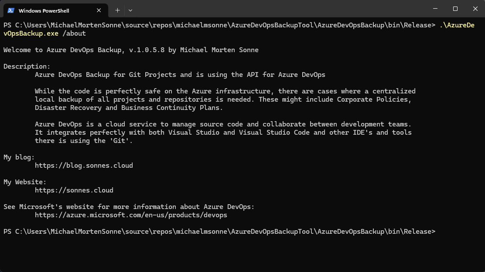

# Introduction
Azure DevOps is a cloud service to manage source code and collaborate between development teams. It integrates perfectly with both Visual Studio and Visual Studio Code and other IDE´s and tools there is using the "Git".
While your code is perfectly safe on the Azure infrastructure hosted by Microsoft, there are cases where a centralized local backup of all projects and repositories is needed. These might include Corporate Policies, Disaster Recovery and Business Continuity Plans.
We can download a repository from Azure DevOps as a Zip file, but this may not be practical if we have a considerable amount of projects and repositories and need them backed up on a regular basis. To do this, we can use the Azure DevOps API, as explained here: https://learn.microsoft.com/en-us/rest/api/azure/devops/?view=azure-devops-rest-7.1 💪

## Download

[Download the latest version](../../releases/latest)

[Version History](CHANGELOG.md)

## Usage Instructions on Windows

1. Downloaded the installer from releases to any location on a Windows machine where you want to use the tool
2. Run the downloaded installer and select where you will install the tool
3. When installed you need an access token to connect to Azure DevOps (read the guide under here)
4. Then run the main AzureDevOpsBackup.exe with the appropriate command line options to connect to your Azure DevOps and download the backup use with command line options in CMD, PowerShell or Windows Terminal!
5. You now have an local backup!

# How to get a local backup of your repos on your backup/home server? 🤔

## 1. Get an Azure DevOps API personal access token
On the top right corner of the Azure DevOps portal we have our account picture. When clicking on it reveals the account menu where we find a Security option. Inside Security, we have Personal access tokens. We click on New token to create one.
For this example we only need to check the Read, write & manage permission for Code. When we name the token and click Create, we get the token value, but since it won’t be shown again, we must copy and save it elsewhere. We will need this token later, to access the API!

## 2. Clone the repository, configure arguments and dependencies
To get the sample code, we can clone this GitHub repository or another and open it with etc. Visual Studio. To test the solution in debug mode, we still have to configure a few arguments in the project properties. These arguments will define the access token — obtained on the previous step — , organization — i.e. the Azure DevOps domain — and the local directory where we want to write the backed up data. There is a fourth optional argument to state if we want to unzip the downloaded files — more on that later.

**N.B:** Keep your generated access token in a safe place!

Here’s how the argument list will look like:

`.\AzureDevOpsBackup.exe --token "our-auth-token" --org "our-org" --outdir "C:\backup\out-directory" --server "smtp.server.com" --port "25" --from "azure-devops-backup@domain.com" --to "backupmail@domain.com" --unzip --cleanup --daystokeepbackup 50 --priority high`

This solution uses two external libraries we need to reference: RestSharp to facilitate the API calls and Newtonsoft JSON to deserialize the API responses into objects.

## 3. Analyze and run the code
We start by declaring the data structures for the API responses. Then, the main function cycles through four nested levels of hierarchy — project / repository / branch / item — calling these API endpoints and deserializing the results into the corresponding structures.
Hence, for each project, we get a list of the repositories it contains and for each repository, we get a list of the items it contains.

When we get to the repository level we don’t need to make individual API calls to download every single item on the repository. Instead, we can download all the items, packed into a Zip file with a single API call. In order to do this, we still need the item list, because we have to build a JSON structure containing every item on the list where the property gitObjectType equals “blob”. This JSON structure will then be posted to the /blobs endpoint to obtain the Zip file as a response.

Note we are also saving the original JSON item list we got from the repository call. This will be needed to map the files inside the Zip package, because these are presented in a single flat directory and their names are the object ids and not their actual names and extension. This is where the --unzip argument enters. If it’s omitted, the process does not go further and we get a simple backup: for every repository of each project we get a Zip file with the content and a JSON file to map it.

Mandatory arguments is: **`--token, --org, --outdir, --server, --port, --from and --to`**

If the **--unzip** argument is present, the program will create a directory for each repository based on the information provided by each Zip/JSON file pair. In this directory, we will get the original file and folder structure with real file names and extensions. Looping through all the items on the JSON list file, we consider a simple condition: if the item is a folder we create the directory according to the item.path property. Otherwise, we assume it’s a blob and we extract it from the Zip archive into the corresponding directory assigning the original file name and extension.

If the **--cleanup** argument is present, the program will cleanup the blob files downloaded from the API in the backup folder. If not present, the downloaded original .json and .zip files is still the backup folder.
The argument **--unzip** id needed for this to work.

If the **--daystokeepbackup** argument is present, the program will keep that number of days in the backup folder. If not present the default days of backups to keep is **30 days**.
It looks at the backup folder, and see when last changed. If the days matches the days you set, the program **will delete** the old backup in the backup folder you had set.

If the **--simpelreportlayout** argument is present, the program will use the old email report layout, else it will use the new default.

If the **--priority <priority> <high/low>** argument is present, the program will mark the send email with the specified priority, else it will use the default (normal).

Logs for backup jobs is keept in the **.\Log** folder for **30 days** beside **AzureDevOpsBackup.exe**.

# Final thoughts
This is not an exhaustive method to retrieve every artifact on Azure DevOps. There’s a lot more to be done to make this a complete solution.
However, it’s a good starting point to backup your Azure DevOps projects and keep a local repository of these like I do! 😜😉

There is send an email report to the specified email address when the backup is done with status and usefull information about the backup job and more information.

Check out the examples here:

# Email report sample:

**Full layout:**

**Simpel layout:**

# Console use:

**Help menu:**

**About menu:**

---

## How to build

- Get [Visual Studio 2022](https://visualstudio.microsoft.com/vs/community/) (Community Edition is fine)
- Install ".NET desktop development" workload  
  
- Remember to select: Install .NET Framework 4.8 SDK
- Build the solution in Visual Studio

---

# Sponsors
## Advanced Installer
The installer is created from a Free Advanced Installer License for Open-Source from <a href="https://www.advancedinstaller.com/" target="_blank">https://www.advancedinstaller.com/</a> - check it out!

## JetBrains
JetBrains specialises in intelligent, productivity-enabling tools to help you write clean, quality code across . NET, Java, Ruby, Python, PHP, JavaScript, C# and C++ platforms throughout all stages of development. <a href="https://www.jetbrains.com/" target="_blank">https://www.jetbrains.com/</a> - check it out!

## SAST Tools
[PVS-Studio](https://pvs-studio.com/en/pvs-studio/?utm_source=github&utm_medium=organic&utm_campaign=open_source) - static analyzer for C, C++, C#, and Java code.
